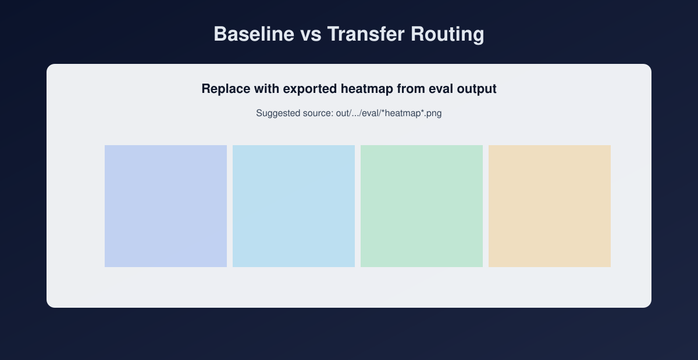
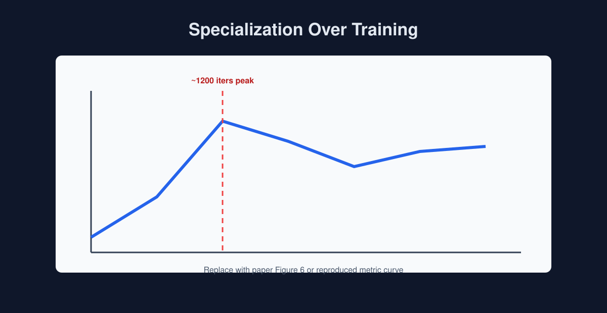
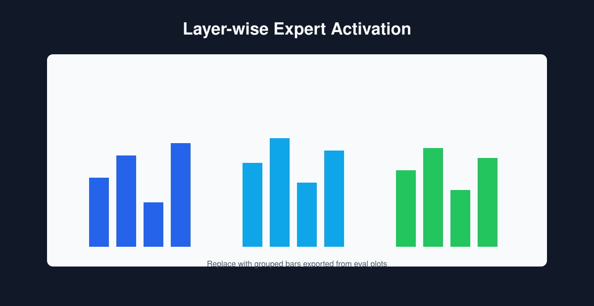

# A Transparent MoE

Research and engineering workspace for building a transparent Mixture-of-Experts (MoE) language model pipeline with sequence-level routing, expert specialization, and reproducible evaluation on MMLU-style domain splits.

Final project paper: [A transparent MoE for sequence-level routing paper.pdf](A%20transparent%20MoE%20for%20sequence-level%20routing%20paper.pdf)

## Why This Project

Most MoE repos optimize for scale, but are harder to inspect and debug. This workspace focuses on:

- **Interpretability-first MoE workflows** (routing heatmaps, specialization ablations)
- **Practical training recipes** for both 4GB and 16GB GPU setups
- **Transparent experimentation** from early concept notes to reproducible scripts

## Highlights (For Recruiters)

- Built and analyzed a **sequence-level MoE routing pipeline** with explicit expert specialization controls.
- Implemented an **end-to-end 3-stage training workflow** (benchmark, expert pretrain, transfer) with reproducible runners.
- Added **interpretability-first evaluation tooling** (routing heatmaps, layer-wise expert usage, specialization ablations).
- Conducted **quantitative specialization analysis** using cosine distance and Jensen-Shannon metrics across training stages.
- Optimized experiments for **resource-constrained and mid-range hardware** (4GB and 16GB VRAM workflows).

Technical stack: Python, PyTorch, nanoGPT-style training loops, MoE routing, WandB logging, Matplotlib/Seaborn analysis.

## Repository At A Glance

This repo contains one main implementation track and several research/support tracks:

- `nanoGPT-LoRA/`:
  - Primary implementation for the Transparent MoE workflow
  - Training, pretraining, transfer, and evaluation scripts
  - Includes automated runners (`autorun_workflow.py`, `autorun_workflow_16gb.py`)
  - See `nanoGPT-LoRA/README.md` for detailed script-level documentation
- `nanoMoE-master/`:
  - Upstream/forked baseline for MoE-capable nanoGPT-style training
  - Useful reference point for architecture and baseline configs
- `draft_HL/`:
  - Work-in-progress training/plotting experiments
- `draft_BP/`:
  - Data prep notebooks, MMLU utilities, and report assets
- `Abstract_Initial_Idea/`:
  - Early project ideation, abstracts, and presentation materials

## Main Workflow (Transparent MoE)

The central pipeline in `nanoGPT-LoRA/` is a 3-stage workflow:

1. **Benchmark MoE training** on OpenWebText (baseline routing behavior)
2. **Subject-specific expert pretraining** with forced routing (specialization)
3. **Transfer training** back on general text (retain + blend specialization)

Evaluation includes:

- Per-subject routing heatmaps
- Layer-wise expert usage plots
- Leave-one-expert-out specialization ablations

## Final Paper Findings (Short Summary)

Based on the final paper results:

- Baseline sequence-level MoE reproduces **weak domain specialization**, consistent with Fan et al. (2024).
- Pretraining experts on subject-specific data and transferring to general data yields **stronger specialization than baseline** in early transfer.
- Specialization appears to **peak around 1200 iterations** and then declines with continued general-data training.
- Reported metrics (paper Table 3) indicate this trend:
  - Benchmark: CosDist `0.066874`, JSM `0.033323`
  - Transfer @1200: CosDist `0.102351`, JSM `0.047709` (strongest observed)

Interpretation from the paper: expert-initialization helps induce specialization, but long transfer on broad OpenWebText may dilute narrow domain effects over time.

## Results Snapshot

Add exported figures from your paper/runs under `assets/results/` and embed them below.

### Baseline vs Transfer Routing



Suggested caption: Subject-conditioned routing is visibly stronger after transfer from expert-pretrained initialization than in the baseline model.

### Specialization Over Training



Suggested caption: Specialization increases early, peaks around ~1200 iterations, then gradually declines with extended general-data training.

### Layer-wise Expert Activation



Suggested caption: Layer-level activation frequencies show weak-to-moderate, subject-dependent expert usage patterns.

### Key Metrics Table (From Final Paper)

| Model/Checkpoint | CosDist (avg pairwise) | JSM |
| --- | ---: | ---: |
| Benchmark (3k) | 0.066874 | 0.033323 |
| Transfer eval@600 | 0.054552 | 0.032388 |
| Transfer eval@1200 | **0.102351** | **0.047709** |
| Transfer eval@1800 | 0.078089 | 0.038246 |
| Transfer eval@2400 | 0.085084 | 0.043014 |
| Transfer eval@3000 | 0.087617 | 0.042046 |

## Experiments Map (Code -> Paper)

| Paper Section | Goal | Main Script(s) | Typical Output |
| --- | --- | --- | --- |
| 3.1 / 4.1 Baseline model | Reproduce weak specialization from sequence-level routing | `nanoGPT-LoRA/train.py`, `nanoGPT-LoRA/eval.py` | Baseline checkpoint + routing heatmaps |
| 3.3.1 Narrow expert pretraining | Induce subject-wise expert specialization | `nanoGPT-LoRA/pretrain.py` | Pretrained experts + per-subject checkpoints |
| 3.3.2 Transfer learning | Test retention of specialization on general data | `nanoGPT-LoRA/train.py` (resume), `nanoGPT-LoRA/post_train.py` | Transfer checkpoint |
| 4.2 / 4.5 Comparison analysis | Quantify specialization differences | `nanoGPT-LoRA/eval.py` + metric analysis in paper | CosDist/JSM trend comparisons |
| 4.3 / Ablation view | Probe expert contribution | `nanoGPT-LoRA/eval_specialization.py` | Loss deltas + routing purity/frequency CSVs |
| Full pipeline automation | Reproducible end-to-end execution | `nanoGPT-LoRA/autorun_workflow.py`, `nanoGPT-LoRA/autorun_workflow_16gb.py` | Stage-wise run folders + logs |

## Quick Start

### 1) Environment

```bash
cd nanoGPT-LoRA
pip install torch transformers datasets wandb tiktoken matplotlib seaborn numpy
```

### 2) Prepare data

- OpenWebText binaries in `nanoGPT-LoRA/data/openwebtext/`
- MMLU subject binaries in `nanoGPT-LoRA/data/mmlu/`
- MMLU question files can be generated via:

```bash
python scripts/prepare_mmlu_questions.py \
  --out_dir data/mmlu_questions \
  --split test \
  --include_choices \
  --config all \
  --subjects college_chemistry,global_facts,management,medical_genetics
```

### 3) Run end-to-end workflow (16GB profile)

```bash
python autorun_workflow_16gb.py \
  --run_name run_16gb_demo \
  --device cuda \
  --do_transfer_eval
```

For detailed options, see:

- `nanoGPT-LoRA/README.md`
- `nanoGPT-LoRA/README_16GB_WORKFLOW_1201A.txt`
- `nanoGPT-LoRA/README_4GB.txt`

## What Is Production-Ready vs Experimental

- **Most stable path:** scripts and configs under `nanoGPT-LoRA/`
- **Reference baseline:** `nanoMoE-master/`
- **Exploratory / draft:** `draft_*` and parts of `Abstract_Initial_Idea/`

## Suggested Reading Order

1. `nanoGPT-LoRA/README.md`
2. `nanoGPT-LoRA/autorun_workflow_16gb.py`
3. `nanoGPT-LoRA/pretrain.py`
4. `nanoGPT-LoRA/eval.py`
5. `nanoGPT-LoRA/eval_specialization.py`

## Current Status

- Active research project with reproducible training/evaluation scripts
- Focused on understanding and visualizing expert specialization behavior
- Ongoing work on cleaner packaging, tests, and benchmark reporting
- Final report complete; current codebase supports follow-up experiments on specialization retention

## License

This workspace contains multiple subprojects and inherited components. See per-folder license files:

- `nanoGPT-LoRA/LICENSE`
- `nanoMoE-master/LICENSE`
